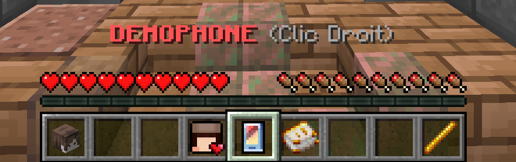

# 📱 DEMOPHONE

Le **DEMOPHONE** est l'objet le plus important de DEMOCRAFT : il vous permet de vous déplacer entre les différents serveurs, voir vos amis, gérer votre groupe, utiliser des cosmétiques, voir vos staistiques, nos réseaux... Bref, l'outil parfait.

## 🧐  Comment l'utiliser ?

Le **DEMOPHONE** est par défaut dans votre inventaire [au lobby](#user-content-fn-1)[^1]. Il est au milieu de votre inventaire

<figure><figcaption>
Le DEMOPHONE dans votre inventaire
</figcaption></figure>

Effectuez un clic droit dans le vide. Le menu suivant s'ouvrira :

<figure><figcaption>
Menu du DEMOPHONE
</figcaption></figure>

<table data-full-width="true"><thead><tr><th>Menu</th><th>Boutton</th><th data-hidden></th></tr></thead><tbody><tr><td><mark style="color:blue;"><strong>JOUER</strong></mark> Ce bouton vous permet d'afficher tout les modes de jeux sur DEMOCRAFT.</td><td></td><td></td></tr><tr><td></td><td></td><td></td></tr><tr><td><mark style="color:purple;"><strong>COSMETIQUES</strong></mark> Ce bouton vous permet d'afficher tout vos cosmétiques et de les équiper</td><td></td><td></td></tr><tr><td>
<mark style="color:orange;"><strong>GROUPES</strong></mark>

Ce bouton vous permet d'afficher votre groupe, d'y ajouter des joueurs ou de le supprimer 
</td><td></td><td></td></tr><tr><td><strong>PARAMETRES</strong> Ce bouton ne sert à rien. C'est pas encore codé.</td><td></td><td></td></tr><tr><td></td><td></td><td></td></tr></tbody></table>

## 🪶 DEMOPHONE V2


**ATTENTION !**

La nouvelle version du DEMOPHONE est actuellement en développement. Elle n'est pas disponible pour tout le monde et sur tout les serveur


[^1]: Disponible sur les autres serveurs dans la V2
